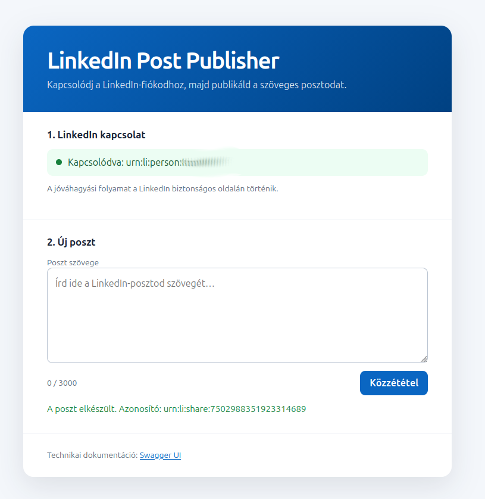

# homework4linkedin
## Setup

Copy example.application.properties to application.properties and set LINKEDIN_CLIENT_ID and LINKEDIN_CLIENT_SECRET environment variable.

## Usage

Open http://localhost:8080/index.html in your browser.

## API Usage
Swagger UI:
http://localhost:8080/swagger-ui/index.html

Authorization API call:
http://localhost:8080/api/linkedin/authorize

First open authorize API in the same browser where the SwaggerUI opened.
Then send a post with /linkedin/posts call.

## Screenshots
